# 📄 Expense Tracker API Documentation

This document contains all the API endpoints for the Expense Tracker project built with Django. Each API is explained with its request format, response format, and usage.

---

## 🔁 API Flow Order

1. Signup – `/signup/`  
2. Login – `/login/`  
3. Change Password – `/changepassword/`  
4. Add Income – `/income/`  
5. Show Income – `/income/<int:user_id>`  
6. Delete Income – `/income/<int:user_id>/delete/<int:income_id>`  
7. Update Income – `/income/<int:user_id>/update/<int:income_id>`  
8. Add Expense – `/expense/`  
9. Show Expense – `/expense/<int:user_id>`  
10. Delete Expense – `/expense/<int:user_id>/delete/<int:expense_id>`  
11. Update Expense – `/expense/<int:user_id>/update/<int:expense_id>`  
12. Get Total – `/total/<int:user_id>`

---

# 📌 API Endpoints Documentation

---

## ✅ 1. User Signup

- **URL**: `/signup/`
- **Method**: `POST`

**Request Body**:
```json
{
  "username": "zahul",
  "email": "zahul01@gmail.com",
  "password": "123234",
  "confirmpassword": "123234"
}
```

**Response Body**:
```json
{
  "message": "User Signup Successfully"
}
```

📸 Screenshot:  
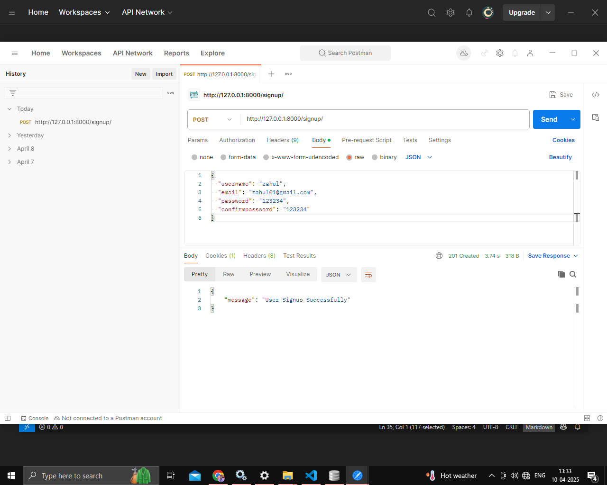

---

## ✅ 2. User Login

- **URL**: `/login/`
- **Method**: `POST`

**Request Body**:
```json
{
  "email": "zahul01@gmail.com",
  "password": "123234"
}
```

**Response Body**:
```json
{
  "message": "Login Successfully"
}
```

📸 Screenshot:  
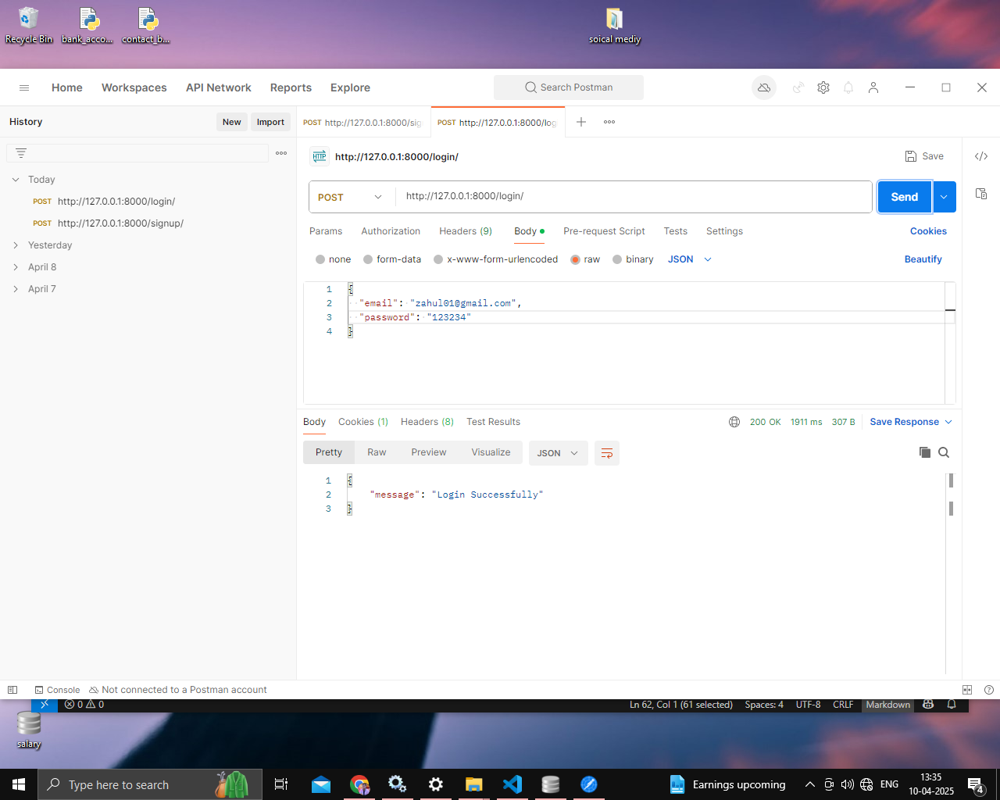

---

## ✅ 3. Change Password

- **URL**: `/changepassword/`
- **Method**: `POST`

**Request Body**:
```json
{
  "email": "zahul01@gmail.com",
  "old_password": "123234",
  "new_password": "123234gymp"
}
```

**Response Body**:
```json
{
  "message": "Change Password Successfully"
}
```

📸 Screenshot:  
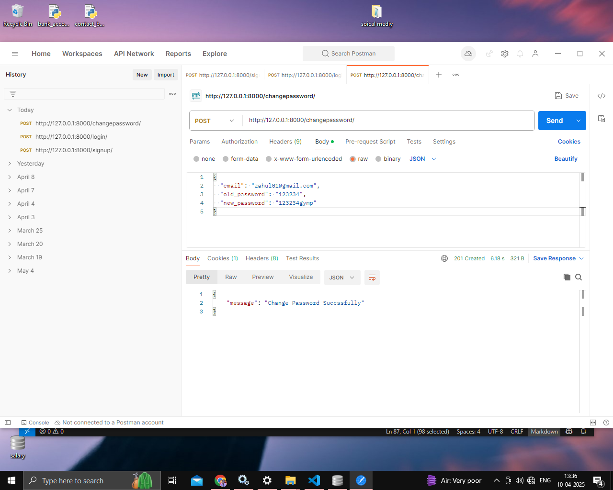

---

## ✅ 4. Add Income

- **URL**: `/income/`
- **Method**: `POST`

**Request Body**:
```json
{
  "id": 8,
  "income_category": 1,
  "amount": 546
}
```

**Response Body**:
```json
{
  "message": "Income added successfully"
}
```

📸 Screenshot:  
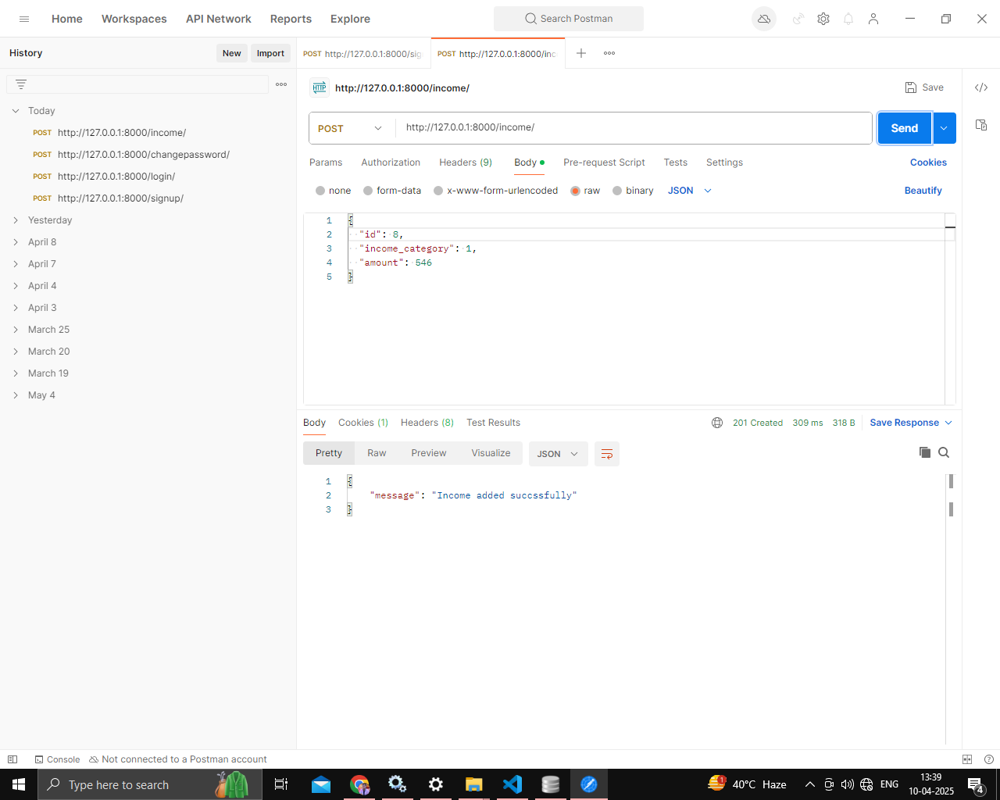

---

## ✅ 5. Show Income

- **URL**: `/income/<int:user_id>`
- **Method**: `GET`

**Example**: `/income/1`

**Response Body**:
```json
{
  "id": 8,
  "user_id": 8,
  "amount": 546,
  "category": "salary",
  "date": "2025-04-10",
  "time": "13:39:39.691"
}
```

📸 Screenshot:  
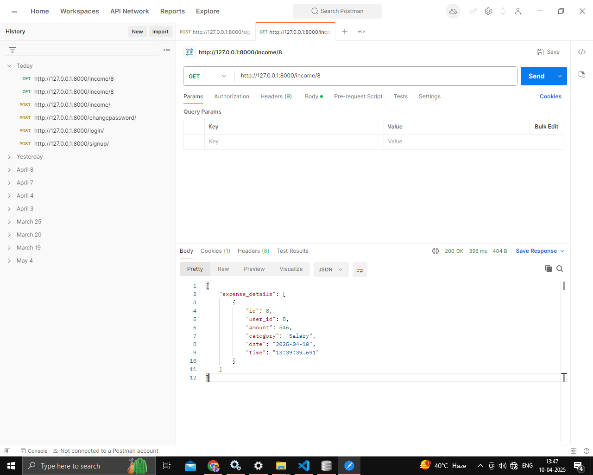

---

## ✅ 6. Delete Income

- **URL**: `/income/<int:user_id>/delete/<int:income_id>`
- **Method**: `DELETE`

**Example**: `/income/8/delete/9`

**Response Body**:
```json
{
  "message": "Income delete successfully"
}
```

📸 Screenshot:  


---

## ✅ 7. Update Income

- **URL**: `/income/<int:user_id>/update/<int:income_id>`
- **Method**: `PATCH`

**Example**: `/income/8/update/8`

**Request Body**:
```json
{
  "income_category_id": 4,
  "amount": 300
}
```

**Response Body**:
```json
{
  "message": "Income update successfully"
}
```

📸 Screenshot:  
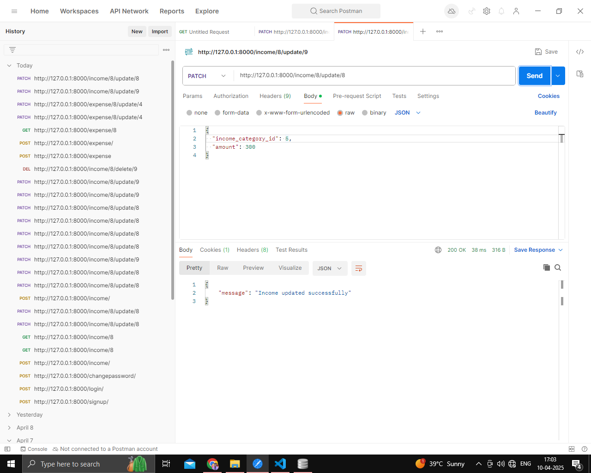

---

## ✅ 8. Add Expense

- **URL**: `/expense/`
- **Method**: `POST`

**Request Body**:
```json
{
  "id": 1,
  "category_id": 2,
  "payment_method_id": 2,
  "amount": 400,
  "description": "expense in my salary"
}
```

**Response Body**:
```json
{
  "message": "Expense added successfully"
}
```

📸 Screenshot:  
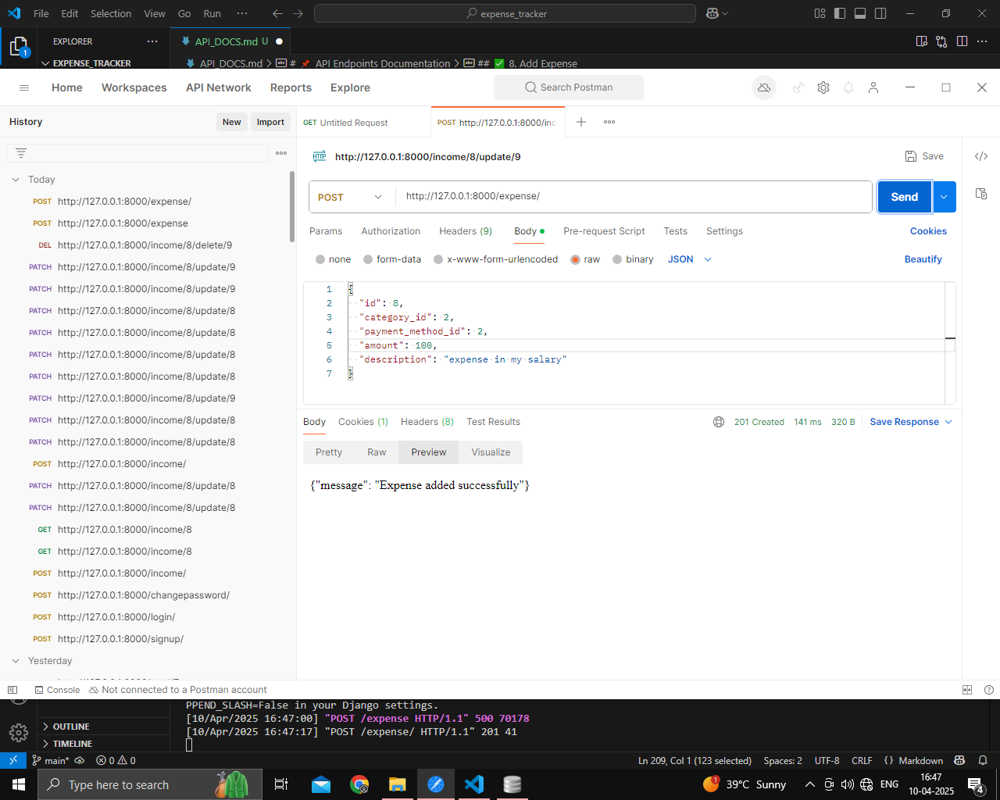

---

## ✅ 9. Show Expense

- **URL**: `/expense/<int:user_id>`
- **Method**: `GET`

**Example**: `/expense/8`

**Response Body**:
```json
{
  "id": 1,
  "category_name": "Rent",
  "amount": 200,
  "payment_method": "PhonePE",
  "description": "save in my salary",
  "date": "2025-04-23",
  "time": "17:03:26.566"
}
```

📸 Screenshot:  
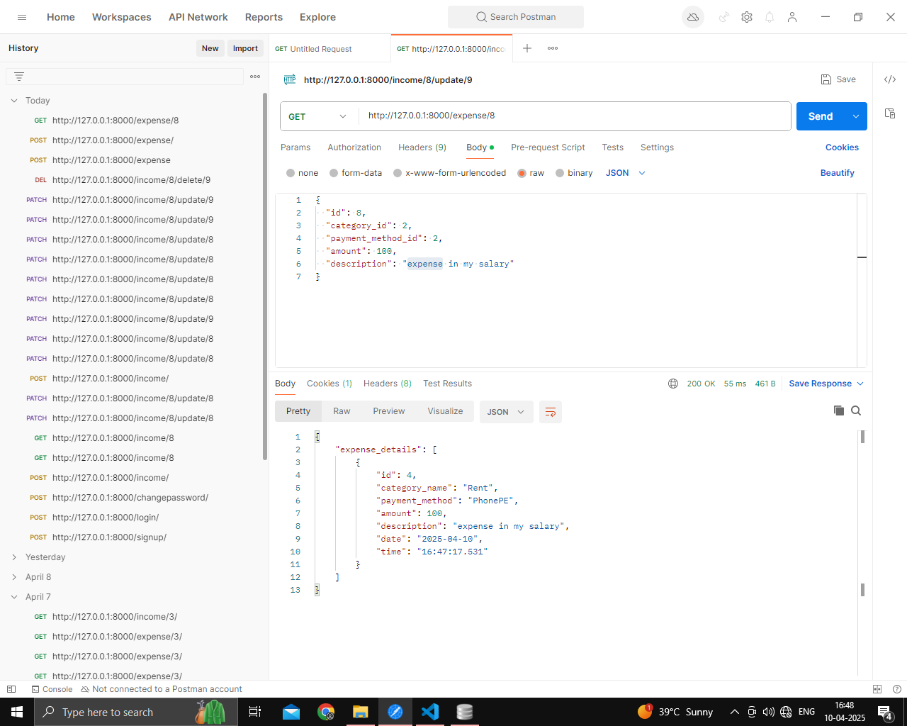

---

## ✅ 10. Delete Expense

- **URL**: `/expense/<int:user_id>/delete/<int:expense_id>`
- **Method**: `DELETE`

**Example**: `/expense/8/delete/4`

**Response Body**:
```json
{
  "message": "Expense delete successfully"
}
```

📸 Screenshot:  
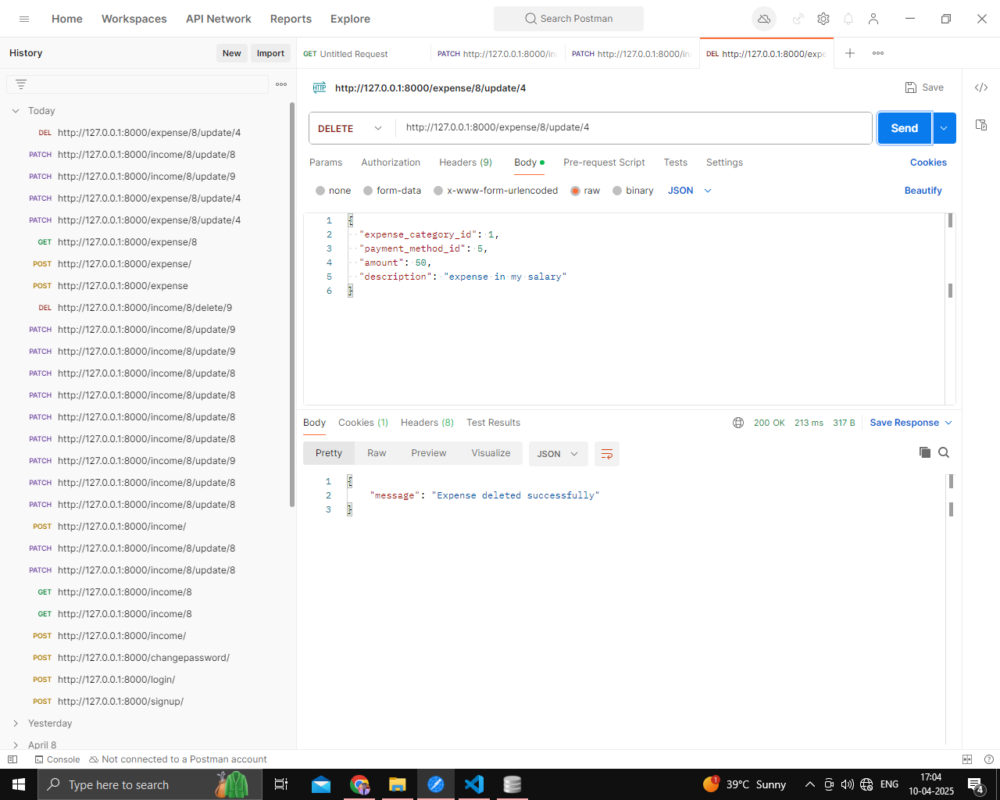

---

## ✅ 11. Update Expense

- **URL**: `/expense/<int:user_id>/update/<int:expense_id>`
- **Method**: `PATCH`

**Example**: `/expense/8/delete/4`

**Request Body**:
```json
{
  "id": 8,
  "expense_category_id": 1,
  "payment_method_id": 5,
  "amount": 50,
  "description": "expense in my salary"
}
```

**Response Body**:
```json
{
  "message": "Expense updated successfully"
}
```

📸 Screenshot:  
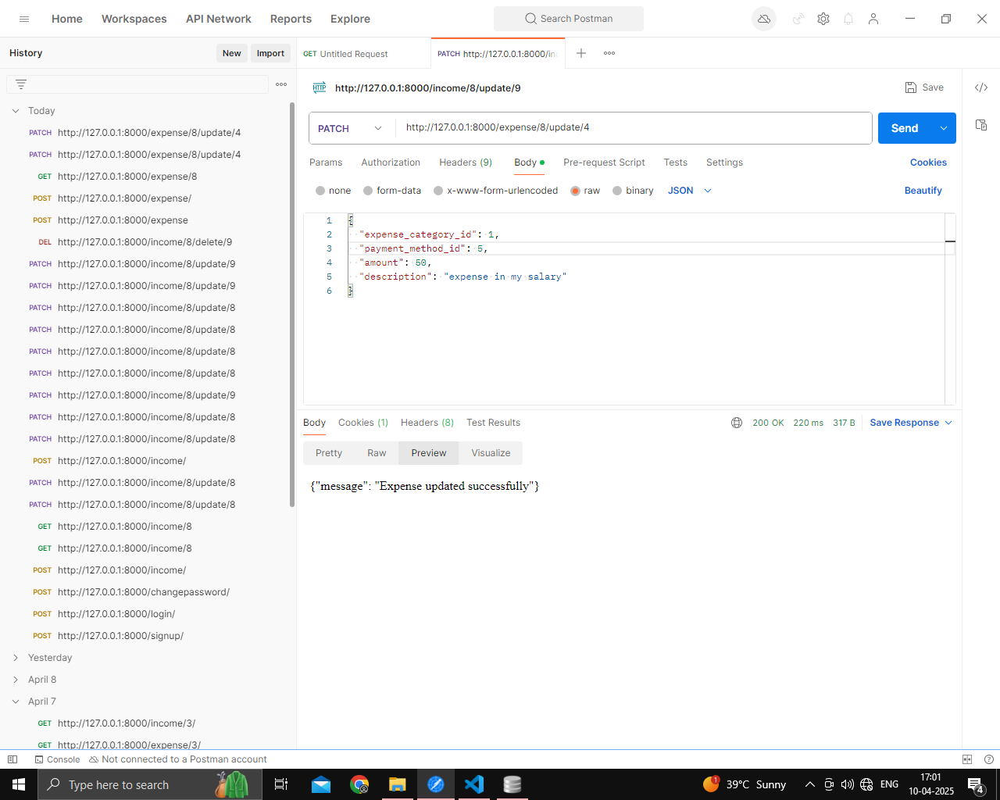

---

## ✅ 12. Show Total

- **URL**: `/total/<int:user_id>`
- **Method**: `GET`

**Example**: `/total/1`

**Response Body**:
```json
{
  "user_id": 1,
  "total_income": 1638,
  "total_expense": 408
}
```

📸 Screenshot:  
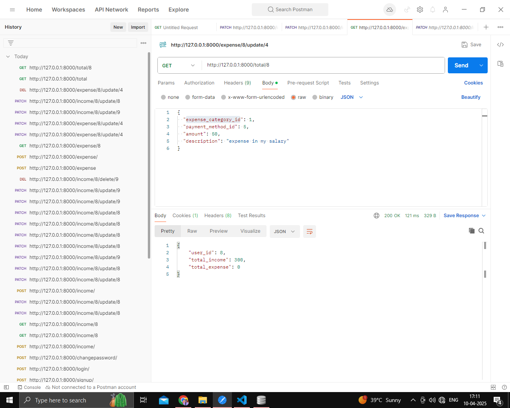

---
